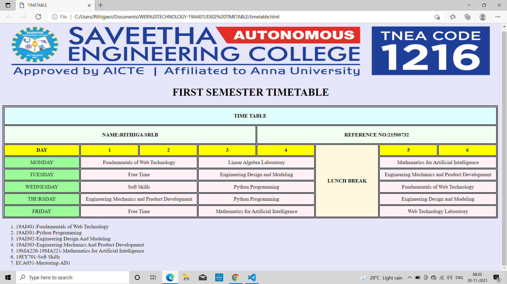
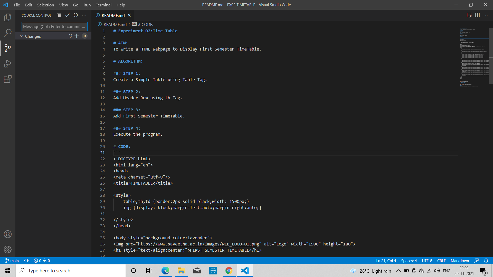
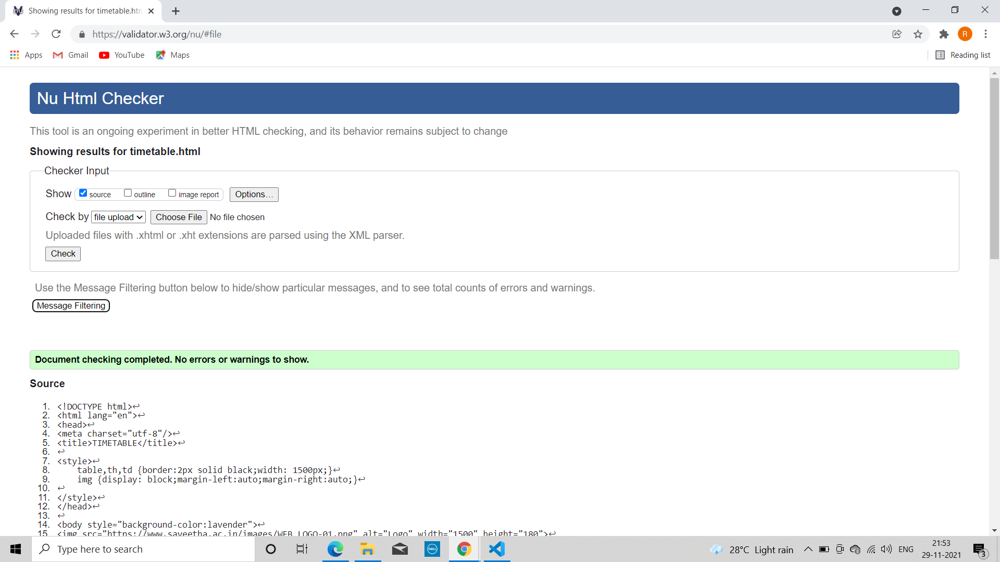

# Experiment 02:Time Table

# AIM:
To Write a HTML Webpage to Display First Semester TimeTable.

# ALGORITHM:

### STEP 1:
Create a Simple Table using Table Tag.

### STEP 2:
Add Header Row using th Tag.

### STEP 3:
Add First Semester TimeTable.

### STEP 4:
Execute the program.

# CODE:
```
<!DOCTYPE html>
<html lang="en">
<head>
<meta charset="utf-8"/>
<title>TIMETABLE</title>

<style>
    table,th,td {border:2px solid black;width: 1500px;}
    img {display: block;margin-left:auto;margin-right:auto;}

</style>
</head>

<body style="background-color:lavender">

<h1 style="text-align:center;">FIRST SEMESTER TIMETABLE</h1>

<table>
       
    <tr>
        <th colspan="8" style="background-color:lightcyan; line-height: 50px;">TIME TABLE</th>

    </tr>
    <tr>
        <th colspan="4" style="background-color: honeydew; line-height: 50px;">NAME:RITHIGA SRI.B</th>
        <th colspan="4" style="background-color: honeydew; line-height: 50px;">REFERENCE NO:21500732</th>
    </tr>

    <tr>
        
        <th style="background-color: yellow; line-height: 30px;text-align: center;">DAY</th>
        <th style="background-color: yellow; line-height: 30px;text-align: center;">1</th>
        <th style="background-color:yellow; line-height: 30px;text-align: center;">2</th>
        <th style="background-color:yellow; line-height: 30px;text-align: center;">3</th>
        <th style="background-color:yellow; line-height: 30px;text-align: center;">4</th>
        <th rowspan="6" style="background-color:cornsilk;text-align: center;">LUNCH BREAK</th>
        <th style="background-color:yellow; line-height: 30px;text-align: center;">5</th>
        <th style="background-color:yellow; line-height: 30px;text-align: center;">6</th>
    </tr>
    <tr>
    
        <td style="background-color:palegreen;text-align: center;">MONDAY</td>
        <td colspan="2" style="background-color: lavenderblush;line-height: 30px;text-align: center;">Fundamentals of Web Technology</td>
        <td colspan="2" style="background-color: lavenderblush;line-height: 30px;text-align: center;">Linear Algebra Laboratory</td>
        <td colspan="2" style="background-color: lavenderblush;line-height: 30px;text-align: center;">Mathematics for Artificial Intelligence</td>
    </tr>
    <tr>
        <td style="background-color:palegreen;text-align: center;">TUESDAY</td>
        <td colspan="2" style="background-color: lavenderblush;line-height: 30px;text-align: center;">Free Time</td>
        <td colspan="2" style="background-color: lavenderblush;line-height: 30px;text-align: center;">Engineering Design and Modeling</td>
        <td colspan="2" style="background-color: lavenderblush;line-height: 30px;text-align: center;">Engineering Mechanics and Product Development</td>
    </tr>
    <tr>
        <td style="background-color:palegreen;text-align: center;">WEDNESDAY</td>
        <td colspan="2" style="background-color: lavenderblush;line-height: 30px;text-align: center;">Soft Skills</td>
        <td colspan="2" style="background-color: lavenderblush;line-height: 30px;text-align: center;">Python Programming</td>
        <td colspan="2" style="background-color: lavenderblush;line-height: 30px;text-align: center;">Fundamentals of Web Technology</td>
    </tr>
    <tr>
        <td style="background-color:palegreen;text-align: center;">THURSDAY</td>
        <td colspan="2" style="background-color: lavenderblush;line-height: 30px;text-align: center;">Engineering Mechanics and Product Development</td>
        <td colspan="2" style="background-color: lavenderblush;line-height: 30px;text-align: center;">Python Programming</td>
        <td colspan="2" style="background-color: lavenderblush;line-height: 30px;text-align: center;">Engineering Design and Modeling</td>
    </tr>
    <tr>
        <td style="background-color:palegreen;text-align: center;">FRIDAY</td>
        <td colspan="2" style="background-color: lavenderblush;line-height: 30px;text-align: center;">Free Time</td>
        <td colspan="2" style="background-color: lavenderblush;line-height: 30px;text-align: center;">Mathematics for Artificial Intelligence</td>
        <td colspan="2" style="background-color: lavenderblush;line-height: 30px;text-align: center;">Web Technology Laboratory</td>
    </tr>
</table>
    <ol type="1">
        <li>19AI401-Fundamentals of Web Technology</li>
        <li>19AI301-Python Programming</li>
        <li>19AI302-Engineering Design And Modeling</li>
        <li>19AI303-Engineering  Mechanics And Product Development</li>
        <li>19MA220-19MA221-Mathematics for Artificial Intelligence</li>
        <li>19EY701-Soft Skills</li>
        <li>ECA051-Mentoring-AD1</li>
      </ol>


</body>
</html>
```

# OUPUT:

## CLIENT SIDE OUTPUT:


## SERVER SIDE OUTPUT:


## HTML VALIDATION REPORT:


# RESULT:
A simple website is developed to display the First Semester Timetable.


